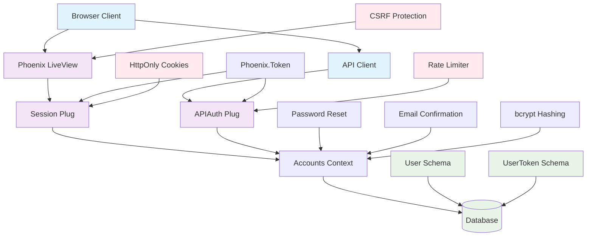

# Architektura Systemu Uwierzytelniania

```mermaid
graph TB
    A[Browser Client] --> B[Phoenix LiveView]
    A --> C[API Client]

    B --> D[Session Plug]
    C --> E[APIAuth Plug]

    D --> F[Accounts Context]
    E --> F

    F --> G[(Database)]

    H[User Schema] --> G
    I[UserToken Schema] --> G

    J[Password Reset] --> F
    K[Email Confirmation] --> F

    L[bcrypt Hashing] --> F
    M[Phoenix.Token] --> D
    M --> E

    N[HttpOnly Cookies] --> D
    O[Rate Limiter] --> E

    P[CSRF Protection] --> B

    classDef frontend fill:#e1f5fe
    classDef backend fill:#f3e5f5
    classDef security fill:#ffebee
    classDef data fill:#e8f5e8

    class A,C frontend
    class B,D,E backend
    class N,O,P security
    class G,H,I data
```
