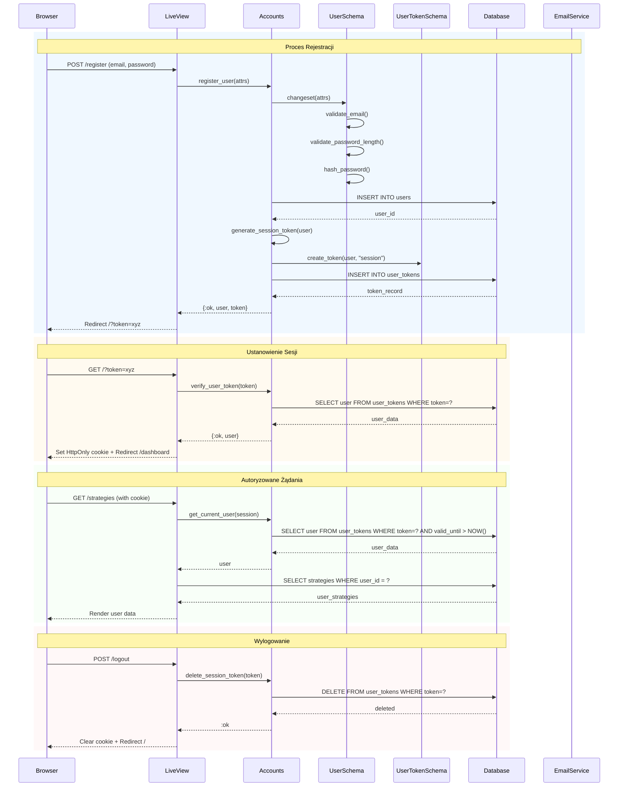

# Szczegółowy Przepływ Rejestracji i Logowania

```mermaid
sequenceDiagram
    participant Browser
    participant LiveView
    participant Accounts
    participant UserSchema
    participant UserTokenSchema
    participant Database
    participant EmailService

    %% Rejestracja
    rect rgb(240, 248, 255)
        Note over Browser,EmailService: Proces Rejestracji
        Browser->>LiveView: POST /register (email, password)
        LiveView->>Accounts: register_user(attrs)

        Accounts->>UserSchema: changeset(attrs)
        UserSchema->>UserSchema: validate_email()
        UserSchema->>UserSchema: validate_password_length()
        UserSchema->>UserSchema: hash_password()

        Accounts->>Database: INSERT INTO users
        Database-->>Accounts: user_id

        Accounts->>Accounts: generate_session_token(user)
        Accounts->>UserTokenSchema: create_token(user, "session")

        Accounts->>Database: INSERT INTO user_tokens
        Database-->>Accounts: token_record

        Accounts-->>LiveView: {:ok, user, token}
        LiveView-->>Browser: Redirect /?token=xyz
    end

    %% Pierwsze logowanie z tokenem
    rect rgb(255, 250, 240)
        Note over Browser,Database: Ustanowienie Sesji
        Browser->>LiveView: GET /?token=xyz
        LiveView->>Accounts: verify_user_token(token)
        Accounts->>Database: SELECT user FROM user_tokens WHERE token=?
        Database-->>Accounts: user_data
        Accounts-->>LiveView: {:ok, user}
        LiveView-->>Browser: Set HttpOnly cookie + Redirect /dashboard
    end

    %% Kolejne żądania
    rect rgb(248, 255, 248)
        Note over Browser,Database: Autoryzowane Żądania
        Browser->>LiveView: GET /strategies (with cookie)
        LiveView->>Accounts: get_current_user(session)
        Accounts->>Database: SELECT user FROM user_tokens WHERE token=? AND valid_until > NOW()
        Database-->>Accounts: user_data
        Accounts-->>LiveView: user
        LiveView->>Database: SELECT strategies WHERE user_id = ?
        Database-->>LiveView: user_strategies
        LiveView-->>Browser: Render user data
    end

    %% Wylogowanie
    rect rgb(255, 248, 248)
        Note over Browser,Database: Wylogowanie
        Browser->>LiveView: POST /logout
        LiveView->>Accounts: delete_session_token(token)
        Accounts->>Database: DELETE FROM user_tokens WHERE token=?
        Database-->>Accounts: deleted
        Accounts-->>LiveView: :ok
        LiveView-->>Browser: Clear cookie + Redirect /
    end
```
