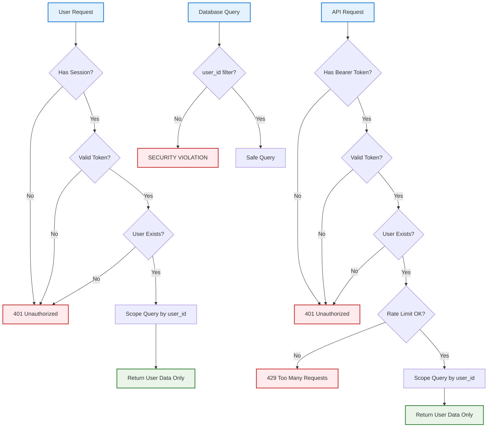

# Bezpieczeństwo Danych i Autoryzacja

```mermaid
flowchart TD
    A[User Request] --> B{Has Session?}
    B -->|No| C[401 Unauthorized]
    B -->|Yes| D{Valid Token?}
    D -->|No| C
    D -->|Yes| E{User Exists?}
    E -->|No| C
    E -->|Yes| F[Scope Query by user_id]
    F --> G[Return User Data Only]

    H[API Request] --> I{Has Bearer Token?}
    I -->|No| J[401 Unauthorized]
    I -->|Yes| K{Valid Token?}
    K -->|No| J
    K -->|Yes| L{User Exists?}
    L -->|No| J
    L -->|Yes| M{Rate Limit OK?}
    M -->|No| N[429 Too Many Requests]
    M -->|Yes| O[Scope Query by user_id]
    O --> P[Return User Data Only]

    Q[Database Query] --> R{user_id filter?}
    R -->|No| S[SECURITY VIOLATION]
    R -->|Yes| T[Safe Query]

    classDef success fill:#e8f5e8,stroke:#2e7d32,stroke-width:2px
    classDef error fill:#ffebee,stroke:#c62828,stroke-width:2px
    classDef warning fill:#fff3e0,stroke:#ef6c00,stroke-width:2px
    classDef process fill:#e3f2fd,stroke:#1976d2,stroke-width:2px

    class G,P success
    class C,J,N,S error
    class A,H,Q process
```
