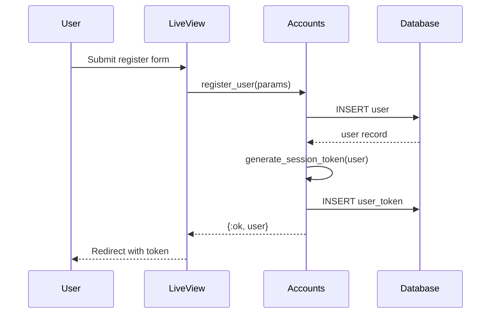
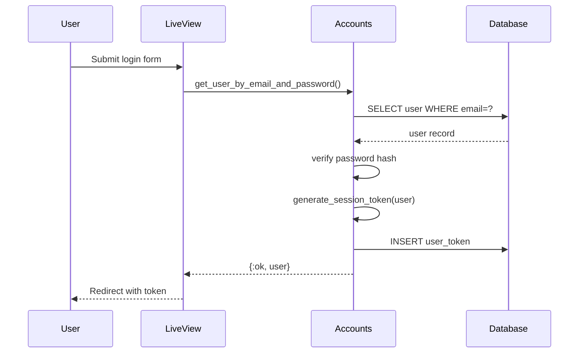
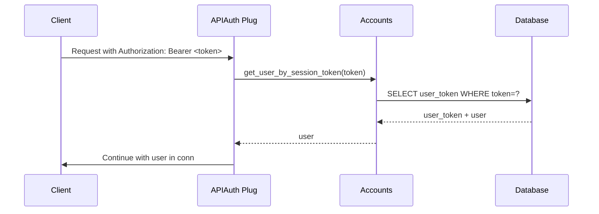

# Architektura Uwierzytelniania - Numbers Evolution

## 1. Przegląd Systemu

### 1.1 Zakres
System uwierzytelniania obsługuje:
- Rejestrację nowych użytkowników
- Logowanie/wylogowanie
- Zarządzanie sesjami
- Reset hasła
- API token authentication
- Izolacja danych po user_id

### 1.2 Architektura Ogólna
```
┌─────────────────┐    ┌─────────────────┐    ┌─────────────────┐
│   Frontend      │    │   LiveView      │    │   Database      │
│   (Browser)     │◄──►│   Sessions      │◄──►│   users         │
│                 │    │   + API Auth    │    │   user_tokens   │
└─────────────────┘    └─────────────────┘    └─────────────────┘
```

## 2. Komponenty Systemu

### 2.1 Context: Accounts
```elixir
NumbersEvolution.Accounts
├── User (schema)
├── UserToken (schema)
├── register_user/1
├── get_user_by_email_and_password/2
├── generate_user_session_token/1
├── get_user_by_session_token/1
└── delete_session_token/1
```

### 2.2 Web Layer
```elixir
NumbersEvolutionWeb
├── Plugs.APIAuth (token validation)
├── Plugs.RateLimiter
├── PageLive (login/register UI)
└── Router (pipelines)
```

## 3. Przepływy Uwierzytelniania

### 3.1 Rejestracja


### 3.2 Logowanie


### 3.3 API Authentication


## 4. Bezpieczeństwo

### 4.1 Session Management
- **Session Tokens**: Phoenix.Token (encrypted, signed)
- **Cookie Flags**: HttpOnly, Secure, SameSite
- **Expiration**: Sessions ważna przez 60 dni
- **Cleanup**: Automatyczne usuwanie wygasłych tokenów

### 4.2 Password Security
- **Hashing**: bcrypt (12 rounds)
- **Minimum Length**: 12 znaków
- **Complexity**: Brak specjalnych wymagań (tylko długość)

### 4.3 API Security
- **Rate Limiting**: 100 requests/minute per IP
- **Token Validation**: Na każdym authenticated request
- **CSRF Protection**: Automatyczne dla form

## 5. User Stories - Uwierzytelnianie

### Story 1: Rejestracja Nowego Użytkownika
**Jako** nowy użytkownik
**Chcę** móc się zarejestrować w systemie
**Aby** mieć dostęp do prywatnych funkcji

**Kryteria akceptacji:**
- Formularz rejestracji z email + password
- Walidacja email format
- Password min. 12 znaków
- Automatyczne logowanie po rejestracji
- Email confirmation (future)

### Story 2: Logowanie do Systemu
**Jako** zarejestrowany użytkownik
**Chcę** móc się zalogować
**Aby** mieć dostęp do swoich danych

**Kryteria akceptacji:**
- Formularz login z email + password
- Pamiętanie sesji między przeglądarkami
- Automatyczne przekierowanie na dashboard
- Obsługa błędnych credentials

### Story 3: Wylogowanie
**Jako** zalogowany użytkownik
**Chcę** móc się wylogować
**Aby** zabezpieczyć dostęp do mojego konta

**Kryteria akceptacji:**
- Przycisk logout w navbar
- Czyszczenie sesji
- Przekierowanie na landing page
- Blokada dostępu do chronionych zasobów

### Story 4: Izolacja Danych
**Jako** użytkownik systemu
**Chcę** widzieć tylko swoje dane
**Aby** zachować prywatność

**Kryteria akceptacji:**
- Wszystkie queries scopowane po user_id
- Brak dostępu do danych innych użytkowników
- API endpoints wymagają valid authentication
- Próba dostępu bez auth → 401 Unauthorized

## 6. Testowanie

### 6.1 Unit Tests
- Accounts context functions
- Token generation/validation
- Password hashing

### 6.2 Integration Tests
- Login/register flows
- Session persistence
- API authentication

### 6.3 E2E Tests
- Complete user registration flow
- Login/logout cycle
- Access control verification

## 7. Monitoring & Alerting

### 7.1 Metrics
- Login attempts (success/failure)
- Registration rate
- Session duration
- API authentication failures

### 7.2 Alerts
- High failure rate (>10%)
- Unusual registration patterns
- Token validation errors
